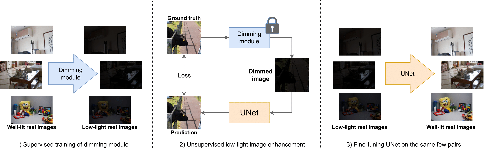
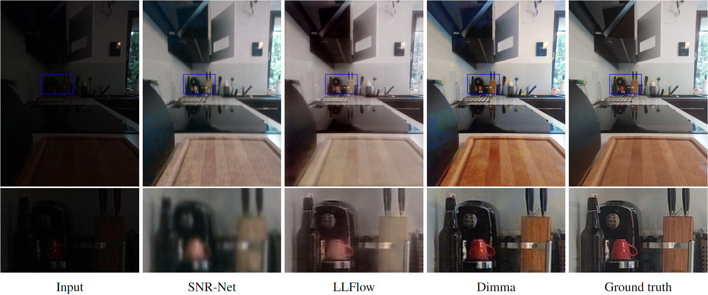
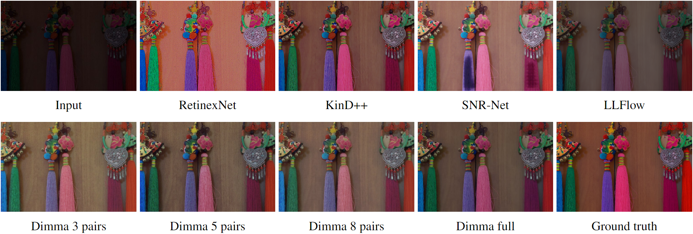

# Dimma: Semi-supervised Low Light Image Enhancement with Adaptive Dimming

## Abstract

We propose Dimma, a semi-supervised approach that aligns with any camera by utilizing a small set of image pairs to replicate scenes captured under extreme lighting conditions taken by that specific camera. Dimma is the perfect solution for quickly creating your custom low-light image enhancement model for your camera, all without the need for extensive image pair collection.

## Results
### Few-shot Dark


|Method       | PSNR ↑          | SSIM ↑          | RGB-SSIM ↑          | LPIPS ↓            | DeltaE ↓            | NIQE ↓            |
| :--:        | :--:            | :--:            | :--:                | :--:               | :--:                | :--:              |
|SNR-Net      | 19.43           | 0.78            | 0.75                | 0.42               | 9.59                | 4.61              |
|LLFlow       | 19.46           | 0.81            | 0.79                | 0.35               | 9.69                | 3.50              |
|Dimma (ours) | **24.14**       | **0.83**        | **0.81**            | **0.27**           | **6.14**            | **2.93**          |

### LOL


| Method         | PSNR ↑    | SSIM ↑   | RGB-SSIM ↑ | LPIPS ↓  | DeltaE ↓ | NIQE ↓   | Train pairs ↓ |
| :--:           | :--:      | :--:     | :--:       | :--:     | :--:     | :--:     | :--:          |
| RetinexNet     | 16.77     | 0.52     | 0.42       | 0.47     | 15.89    | 9.73     | 485           |
| KinD           | 17.65     | 0.83     | 0.77       | 0.18     | 12.49    | 3.89     | 450           |
| Zero-DCE       | 14.86     | 0.65     | 0.56       | 0.34     | 18.82    | 8.22     | 360           |
| EnlightenGAN   | 17.48     | 0.70     | 0.65       | 0.32     | 14.48    | 4.89     | 0             |
| RUAS           | 16.40     | 0.70     | 0.50       | 0.27     | 16.83    | 5.93     | 100           |
| KinD++         | 21.80     | 0.88     | 0.83       | 0.16     | 8.50     | 4.00     | 460           |
| SNR-Net        | 24.61     | 0.90     | 0.84       | *0.15*   | 6.85     | 4.02     | 485           |
| LLFlow         | *25.19*   | **0.93** | **0.86**   | **0.11** | *6.40*   | 4.08     | 485           |
| Retinexformer∗ | 25.16     | -        | *0.85*     | -        | -        | -        | 485           |
| Dimma 3 pairs  | 23.54     | 0.83     | 0.76       | 0.26     | 9.20     | 3.93     | 3             |
| Dimma 5 pairs  | 24.49     | 0.84     | 0.76       | 0.25     | 7.98     | 3.81     | 5             |
| Dimma 8 pairs  | 24.70     | 0.86     | 0.78       | 0.23     | 7.81     | *3.56*   | 8             |
| Dimma full     | **27.39** | *0.91*   | **0.86**   | **0.11** | **5.54** | **3.14** | 480           |

## Run the code
To run this code install requirements 
```bash
pip install -r requirements.txt
```
and run one of the following commands:

```bash
python train_supervised.py
python finetune.py
```
For different config file use --config flag. There are many configs in config folder.

Please, bear in mind that you need to first train unsupervised model before running finetune.py. Data and models are not included in this repository. You can get them from the following link: [drive](https://drive.google.com/drive/folders/1mobXx1HI8BS-C8_-U-EHNvbMEPCoGIUK?usp=sharing).
